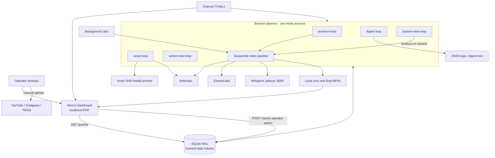
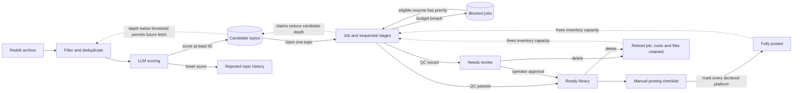
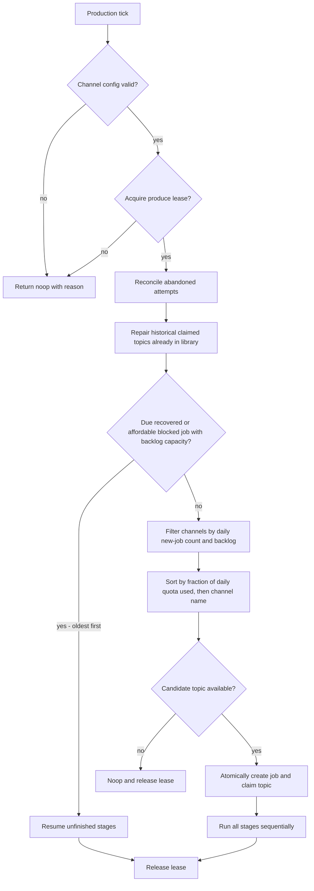
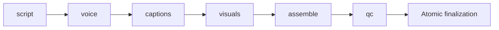
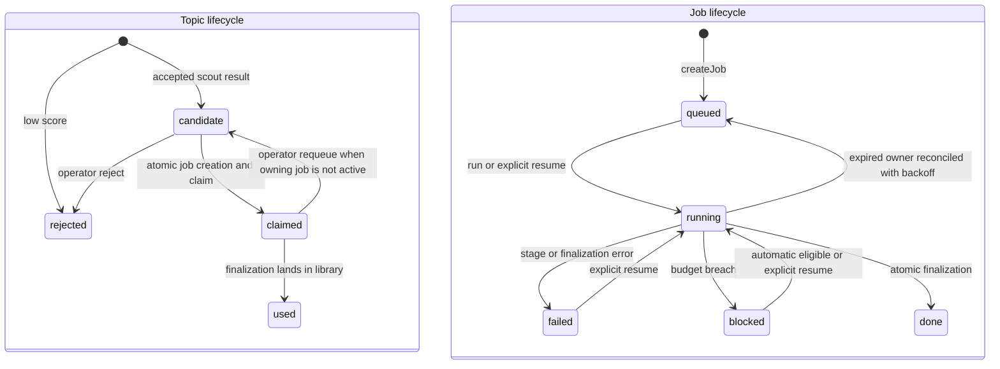
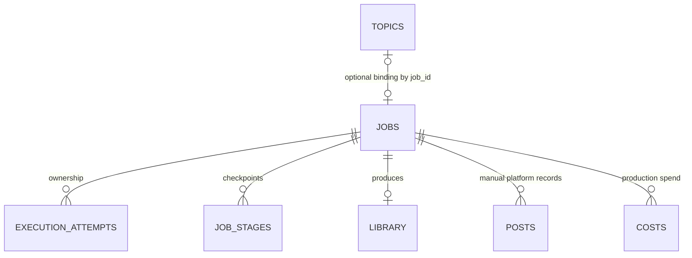

# Current system architecture and queue map

Source snapshot: 2026-09-29. This maps the checked-out implementation and Compose configuration, not observed production queue depths or deployed image versions. Historical design documents and obsolete comments are not authoritative.

## 1. System boundary

Brainrot converts a topic into a captioned vertical video. One Node/TypeScript package contains the CLI, daemon, pipeline, and Remotion composition. Next.js runs as a separate dashboard process using the same application image. WhisperX is a separate Python alignment service.



The daemon's five workers are concurrent asynchronous loops in one process, sharing a SQLite handle and event loop. They are not five independently deployed services. Rendering spawns Chrome/ffmpeg work. Synchronous work can still delay other loops.

Compose mounts:

| Resource                                         | Daemon                  | Dashboard        | Purpose                                                                         |
| ------------------------------------------------ | ----------------------- | ---------------- | ------------------------------------------------------------------------------- |
| `brainrot-data` at `/app/state/db`               | Read/write              | Read/write mount | SQLite and WAL shared-memory files; GET queries use a read-only database handle |
| `docker/state/runs` at `/app/state/runs`         | Read/write              | Read-only        | Stage artifacts and video playback                                              |
| `docker/state/channels` at `/app/state/channels` | Read-only               | Read-only        | Live channel configuration                                                      |
| `assets` at `/app/assets`                        | Read-only               | Not mounted      | Video backgrounds                                                               |
| `whisperx-cache`                                 | Separate sidecar volume | None             | Downloaded alignment models                                                     |

The dashboard has no provider credentials. Its HTTP boundary validates same-origin/Host and CSRF token, validates action arguments, checks daemon liveness, and inserts an action. It never executes pipeline handlers. Compose's daemon/dashboard timezone is America/New_York; daily production and spend accounting use UTC.

Sources: [Compose](../docker-compose.yml), [daemon](../daemon/src/loop/daemon.ts), [submission](../dashboard/lib/server/submission.ts), [database opening](../daemon/src/db/index.ts), [architecture boundary checks](../daemon/src/arch.test.ts).

## 2. What “queue” means here

There is no Redis/RabbitMQ-style message broker. Work is discovered by polling SQLite. Some queues are persistent rows with statuses; others are computed views of existing state.

| Queue / work set     | Representation                                                            | Producer                          | Consumer                      | Selection and capacity                                                                                                            |
| -------------------- | ------------------------------------------------------------------------- | --------------------------------- | ----------------------------- | --------------------------------------------------------------------------------------------------------------------------------- |
| Candidate topics     | `topics.status = candidate`                                               | Scout; operator requeue           | Production planner            | Per channel: score descending, creation time ascending, ID ascending. Scout stops fetching at `ceil(videos_per_day × queue_days)` |
| Blocked-job recovery | `jobs.status = blocked`                                                   | Budget enforcement in runner      | Production planner            | Oldest eligible job first, before any new topic; requires remaining budget                                                        |
| Fast actions         | `operator_actions`, lane `fast`, status `pending`                         | Dashboard                         | `actions-fast`                | ID ascending, up to 50 completions per unit                                                                                       |
| Slow actions         | Same table, lane `slow`                                                   | Dashboard                         | `actions-slow`                | ID ascending with lease-blocked rows skipped within the first 50 pending rows; one completion per unit                            |
| Review inventory     | `library.state = needs-review`                                            | Completed pipeline with QC issues | Human approval/delete actions | Counts toward backlog but does not appear in `/post`                                                                              |
| Manual posting queue | Query of ready library rows missing at least one configured platform post | Pipeline or approval              | Human                         | Oldest library creation time, then job ID; default page limit 200                                                                 |

`jobs.status = queued` is a persisted pre-execution state, not a generic job queue drained by a worker. New production creates a job and immediately calls its runner. After operation-lease acquisition, reconciliation marks abandoned queued/running jobs for automatic recovery. The planner selects due interrupted jobs first, then affordable blocked jobs, then new topics.

## 3. How the queues feed and throttle one another



These are two separate capacity controls:

- **Candidate depth** counts only candidate topics. Claimed, used, and rejected topics do not count. The gate runs before fetching a batch, so one batch—especially a story split into multiple parts—can exceed the threshold. It is not an insertion hard limit.
- **Finished backlog** counts ready and needs-review videos that are not posted to every currently declared platform. Deleted jobs and historically discarded library rows do not count. The automatic new-job planner pauses at `ceil(videos_per_day × backlog_days)`.

Neither `queue_days` nor `backlog_days` is an expiration timer. Videos do not age out. Scouting does not directly check finished inventory: when production stops, scouting may continue until its own candidate threshold is reached.

The checked-in [mvp configuration](../docker/state/channels/mvp.toml) declares 15 videos/day, 3 queue days, 2 backlog days, and YouTube plus Instagram. That means a scout fetch threshold of **45 candidates** and an automatic new-production pause threshold of **30 unconsumed videos**. Posting only to YouTube leaves a video in the backlog; recording Instagram too frees its slot. Approval alone does not free a slot.

An empty platform list never qualifies as fully posted. Such videos can fill the backlog while the channel has no posting cards. The current platform configuration determines completion; changing that list can change which existing videos count as unconsumed.

Sources: [scout gates](../daemon/src/scout/scout.ts), [topic selection](../daemon/src/scout/topics.ts), [planner](../daemon/src/loop/plan-tick.ts), [inventory](../daemon/src/jobs/library.ts), [shared fully-posted predicate](../daemon/src/posts/posts.ts), [posting query](../dashboard/lib/server/queries/post.ts).

## 4. Automatic production decisions



The quota counts **all jobs created today**, including failed jobs; it is not a count of successful videos or platform uploads. Across channels, the planner chooses the least-filled daily quota first. Inside a channel, it chooses the highest-scored candidate.

Interrupted and budget-blocked jobs precede new production, oldest first within each group, and obey backlog capacity. They reuse the existing daily quota slot. A blocked job waits at least 60 seconds and resumes only when its recorded upcoming estimate fits the global and optional channel daily caps, or once to probe changed configuration. Unknown requirements wait for a config/day change after the first probe. Both caps reset at UTC midnight; there is no per-video budget.

New-job selection itself does not preflight budgets. Paid stages enforce the global-day limit and an optional channel-day limit before provider calls; a selected job can therefore become blocked. Scout scoring records spend under `scout:<channel>`, sharing both daily limits with production. It preflights the full batch and rechecks each scoring chunk, including unledgered batch costs. The global limit is `BRAINROT_GLOBAL_DAILY_USD` (default $25); a channel's optional `[budget] per_day_usd` must be strictly lower. These checks are not an atomic reservation of all future spend across concurrent work.

`jobs.produce` executes an operator-supplied topic directly. It acquires the production lease through the action worker but bypasses candidate selection, planner quota, and backlog gates. Paid-stage budget checks still apply. Its created job subsequently counts toward that day's job total. `jobs.resume` similarly bypasses automatic planner selection.

Sources: [planTick](../daemon/src/loop/plan-tick.ts), [produceNextTick](../daemon/src/loop/produce-next.ts), [budget checks](../daemon/src/jobs/costs.ts), [handlers](../daemon/src/actions/handlers.ts).

## 5. Operator actions and lease coordination

```mermaid
sequenceDiagram
  participant UI as Browser
  participant HTTP as Dashboard HTTP
  participant DB as SQLite
  participant W as Action worker
  participant H as Handler
  UI->>HTTP: POST /api/actions
  HTTP->>HTTP: CSRF, Host/origin and argument validation
  HTTP->>DB: Read daemon heartbeat
  alt heartbeat missing or older than 60 seconds
    HTTP-->>UI: 409; nothing queued
  else daemon appears live
    HTTP->>DB: INSERT pending action with catalog lane
    HTTP-->>UI: 202 with action ID
  end
  W->>DB: Read oldest pending rows for its lane
  opt action declares a lease
    W->>DB: Acquire produce or scout lease
    Note over W,DB: If held: leave pending, set notice, skip row
  end
  W->>DB: Guarded pending to running claim
  W->>H: Validate args and execute
  H-->>W: Result or exception
  W->>DB: Store done/result or failed/error
  W->>DB: Release worker-acquired lease
  UI->>HTTP: Refresh action and domain state
```

| Lane | Actions                                                                                                       | Worker-acquired lease                                        |
| ---- | ------------------------------------------------------------------------------------------------------------- | ------------------------------------------------------------ |
| Fast | `topics.reject`, `topics.requeue`, `library.approve`, `jobs.delete`, `digest.run`, `post.mark`, `post.unmark` | None                                                         |
| Slow | `jobs.produce`, `jobs.resume`                                                                                 | `produce`                                                    |
| Slow | `scout.run`                                                                                                   | `scout`                                                      |
| Slow | `produce.next`                                                                                                | None at worker level; the tick acquires `produce` internally |

Fast actions do local operations without provider calls, rendering, or lease acquisition. The slow lane is serial: once a handler starts, other slow actions wait even if they need a different lease. The independent automatic scout/produce loops can still run when their leases allow it.

Leases have three **global names**: `daemon` enforces one daemon, and `produce`/`scout` coordinate operation ownership across daemon, actions and CLI. They are not per-channel locks. They prevent normal overlap between automatic and operator-triggered work of the same class. Scouting and production can run concurrently.

| Caller                                           | Lease     | TTL       | Renewal                                    |
| ------------------------------------------------ | --------- | --------- | ------------------------------------------ |
| Daemon                                           | `daemon`  | 5 minutes | Every 60 seconds, including graceful drain |
| Production, resume, produce-next (CLI or daemon) | `produce` | 5 minutes | Every 60 seconds                           |
| Scouting (CLI or daemon)                         | `scout`   | 5 minutes | Every 60 seconds                           |

Every acquisition has a fresh random owner token. Expired owners cannot renew.
Lost ownership aborts supported I/O and fences transactional state changes.
Stage files live under unique attempt directories; a late renderer cannot overwrite
a replacement's files. Completed checkpoints reference immutable directories.
Cancellation cannot retract a paid request already accepted by a provider.

Each poll inspects at most 50 pending rows. A lease-blocked action remains pending and can be skipped in favor of later work inside that window. If the first 50 remain blocked, row 51 remains unseen on subsequent polls until earlier rows clear. There is no priority boost for operator production over the automatic producer.

`produce.next` has distinct behavior: because the handler takes its own lease, contention returns a **done action with a lease-held noop result**, rather than a pending action waiting for a lease. Likewise, a returned pipeline result of failed/blocked is stored as a done action; only an exception makes the action failed. Inspect the result and referenced job, not just action status.

Sources: [catalog](../daemon/src/actions/catalog.ts), [queue persistence](../daemon/src/actions/queue.ts), [action worker](../daemon/src/loop/actions-worker.ts), [lease implementation](../daemon/src/loop/lease.ts), [handlers](../daemon/src/actions/handlers.ts).

## 6. Pipeline and state transitions



| Stage        | Main work / dependencies                                                                                                                | Output role                                                     |
| ------------ | --------------------------------------------------------------------------------------------------------------------------------------- | --------------------------------------------------------------- |
| Script       | Anthropic generates narration and platform metadata; story mode assembles sanitized source body locally and uses the model for metadata | Narration, hook, platform copy                                  |
| Voice        | Required ElevenLabs voice; missing credentials or provider errors fail the job                                                          | Audio and voice metadata; ElevenLabs also supplies word timings |
| Captions     | Use voice timings when present; otherwise call WhisperX                                                                                 | Word-level caption timings                                      |
| Visuals      | Select background assets; loop/crop with ffmpeg; track recent usage                                                                     | Background video inputs                                         |
| Assemble     | Remotion React composition, Chrome renderer, ffmpeg                                                                                     | `assemble/final.mp4`                                            |
| QC           | Local media checks using probe/ffmpeg and artifacts                                                                                     | QC verdict                                                      |
| Finalization | Read artifacts and commit database state                                                                                                | Library upsert, job done, claimed topic used in one transaction |

There are no separate voice/render/QC queues. One `runJob` call awaits each stage. Stage status and committed `artifact_dir` references are the resume checkpoints. New outputs live under `<root>/runs/<jobId>/attempts/<attemptId>/<stage>/`; null references on legacy completed stages resolve to the original `<jobId>/<stage>/` directories. A completed stage is skipped on resume. A failed paid attempt can still have ledgered cost; a retry is not necessarily free. A budget error blocks the job before the paid call.



Job `done` can mean either library `ready` or `needs-review`. A QC verdict that fails checks leads to needs-review; an exception executing QC fails the job. Legacy library `blocked` means previously discarded, whereas job `blocked` means budget-stopped. The removal action now retires the entire job through `jobs.delete`. They are different state machines.

Posting does not change ready into a published state. The existence of a `posts` row for each `(job_id, platform)` records actual manual posting. Marking is idempotent; correcting its URL preserves the original posting time. Unmark removes that record and can put the video back into the pending checklist.

Story mode expands one source post into multiple topics/jobs/videos with a shared series key and individual part numbers. The production selector uses normal score/time/ID ordering; the posting page uses creation ordering. There is no per-platform predecessor enforcement, so the human must post parts in sequence.

Sources: [pipeline order](../daemon/src/jobs/pipeline.ts), [runner](../daemon/src/jobs/runner.ts), [resume](../daemon/src/jobs/resume.ts), [stages](../daemon/src/stages), [posting records](../daemon/src/posts/posts.ts).

## 7. Persistence map



This diagram shows application relationships, not enforced foreign keys. Database opening explicitly disables SQLite foreign-key enforcement. Scout cost rows use synthetic IDs without job rows, and topic/job one-to-one binding is maintained by application logic rather than a unique `topics.job_id` constraint.

| Table                | Responsibility                                                                     |
| -------------------- | ---------------------------------------------------------------------------------- |
| `topics`             | Discovery history, scores, candidate/claim state, story payloads and deduplication |
| `scout_state`        | Persisted last-attempt time per channel                                            |
| `jobs`               | Production identity, channel, topic, status and timestamps                         |
| `job_stages`         | Per-stage execution checkpoints and errors                                         |
| `library`            | Finished video path, platform metadata, QC verdict and review state                |
| `posts`              | Actual manual posting records by video/platform                                    |
| `costs`              | Provider spend in integer USD micros                                               |
| `bg_usage`           | Recent background usage by channel                                                 |
| `execution_attempts` | Owner token, job, outcome, start/end timestamps for each execution                 |
| `leases`             | Global production/scouting ownership and expiry                                    |
| `operator_actions`   | Durable command queue, results, errors and audit history                           |
| `daemon_state`       | Single-row daemon heartbeat                                                        |

Finished videos remain in the committed assemble attempt directory; legacy
`runs/<jobId>/assemble/final.mp4` paths stay valid. The dashboard reports
each one as `local` or `missing` from that path alone. Delete retires the job,
removes library/post records, and retains costs and local files. If a local video
file is deleted, the application cannot recover it.

The schema is applied and migrations run by the daemon/normal CLI opener. Dashboard read/action handles never initialize or migrate. The production SQLite file lives on the Linux named volume so all WAL users share coherent filesystem memory.

Sources: [schema](../daemon/src/db/schema.sql), [migrations](../daemon/src/db/migrate.ts), [database opener](../daemon/src/db/index.ts), [dashboard handles](../daemon/src/db/dashboard.ts), [library operations](../daemon/src/jobs/library.ts).

## 8. Scheduling, failures, and practical limits

| Worker / mechanism       | Timing and recovery                                                                                                         |
| ------------------------ | --------------------------------------------------------------------------------------------------------------------------- |
| Produce                  | Recheck immediately after work; sleep 30 seconds on idle                                                                    |
| Scout                    | Same loop cadence, but persisted per-channel attempt gate is 20 minutes; force bypasses time gate, not candidate-depth gate |
| Digest                   | At/after 08:00 local time, once per process-day; restart can repeat it; output is logs                                      |
| Fast actions             | Idle poll every 1 second; up to 50 actions per unit; daemon heartbeat stamped at most every 10 seconds                      |
| Slow actions             | Idle poll every 30 seconds; one action per unit; recheck immediately after work                                             |
| Thrown worker-unit error | Log and sleep 60 seconds; no daemon-wide failure merely from one bad unit                                                   |
| Stale daemon heartbeat   | Dashboard refuses new action submissions once heartbeat age exceeds 60 seconds                                              |
| Restart                  | Ownership-aware reconciliation repairs actions before workers start; production ticks schedule abandoned jobs               |

An attempted scout pass records its timestamp before the depth check and fetch. Consequently, a queue-full pass or failed scoring attempt can delay the next automatic attempt by 20 minutes even if capacity becomes available sooner.

Interrupted jobs resume automatically after expired ownership is reconciled, preserving
job ID, topic binding, and done checkpoints. Ordinary failed jobs remain manual.
Recovery backoff is persisted: 30 seconds doubling to 30 minutes for consecutive
interruptions without stage progress, reset by a completed stage. Both recovered
and budget-blocked jobs wait for backlog capacity. A `job-recovery` warning records
old/new attempt, job, action and possible duplicate paid charges.

Daemon-owned actions reconcile once before workers start. Linked unfinished jobs
recover independently while their interrupted actions retain a failure notice;
already-finalized jobs reconstruct the action result. Modern render actions with
no committed job link requeue safely. Legacy ambiguous actions and non-render
actions are not blindly replayed. Topic/job/action linkage commits atomically for
newly created production jobs.

SIGTERM drains active work with ownership still renewed. A forced kill or sleeping
host may leave leases until expiry. Second-daemon startup is refused while the
singleton lease is live. `--force` cannot override live operation ownership.
SQLite guards state commits; immutable attempt files protect local outputs even
when a provider or renderer cannot cancel immediately. Known charges remain ledgered
even after ownership loss; unknown charges cannot be inferred.

Direct CLI produce/resume/scout now coordinate through managed leases. Other
break-glass mutations still follow the operator runbook. This remains a single-daemon
system with serial production and serial slow actions, not a distributed scheduler.

Sources: [worker loops](../daemon/src/loop/daemon.ts), [action execution](../daemon/src/loop/actions-worker.ts), [heartbeat](../daemon/src/loop/daemon-state.ts), [scout attempt gating](../daemon/src/scout/scout.ts), [production lease use](../daemon/src/loop/produce-next.ts), [operator runbook](../README.md).

## 9. Reading a stalled system

| Symptom                                            | First state to inspect                                      | Likely explanation                                                                                  |
| -------------------------------------------------- | ----------------------------------------------------------- | --------------------------------------------------------------------------------------------------- |
| Topics exist but no new videos                     | Jobs created today; pending inventory; leases; blocked jobs | Quota, backlog, held lease, or recovery taking priority                                             |
| No new topics                                      | Candidate depth, scout timestamp, source/scoring results    | Queue full, 20-minute gate, filtered/known sources, scoring failure or daily spend limit            |
| Posting queue empty but backlog full               | Needs-review library and channel platforms                  | Review inventory counts toward backlog; empty platform list produces no cards                       |
| Slow action pending while other activity continues | Action notice and lease expiry                              | Waiting for produce/scout ownership, serial slow work, or 50-row scan window                        |
| Action done but no video appeared                  | Action result, job status, stage errors                     | Noop, budget block, failed job, or needs-review result                                              |
| Restarted daemon but render never resumed          | Job status and saved action notice                          | Wait for lease expiry, persisted recovery delay and backlog capacity; inspect job-recovery warnings |
| Finished video is unavailable                      | Local run path                                              | The local file was moved or deleted and cannot be recovered by the application                      |
| Fully posted video reappears                       | Current platform list and posts rows                        | Unmark or newly declared destination changes completion                                             |

For an individual item, trace **action ID → result/notice job ID → jobs/job_stages → library → posts**. For automatic production, start from **topic ID → topics.job_id**. These are the identities connecting the queue views; there is no single shared queue position spanning discovery, rendering, and posting.
